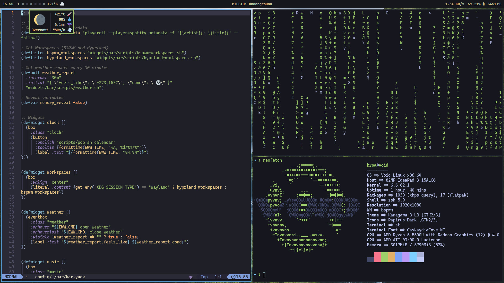

<div align="center">

# dotfiles 🐧
[](https://github.com/MatheusTT/dotfiles/stargazers)
[](https://github.com/MatheusTT/dotfiles/issues)
[](https://github.com/MatheusTT/dotfiles)
[](https://github.com/MatheusTT/dotfiles/blob/master/LICENSE)

</div>

<br>


<details>
<summary>More Screenshots</summary>
  
  
  
</details>


These are my personal configurations for Linux, tailored to enhance productivity and streamline workflows.
They are designed to be lightweight, modular, and easy to manage.

## ⚠️ Notice: Void Linux Configuration (Deprecated)

This `void` branch contains dotfiles tailored for Void Linux. Please note that this branch is no longer actively maintained, as I have transitioned away from using Void Linux. Consequently, updates to this branch will be infrequent or nonexistent.

For the most up-to-date configurations and active maintenance, please refer to the [`master`](https://github.com/MatheusTT/dotfiles/tree/master) branch.

## ⚡ Features
- **Window Managers**: Configurations for Hyprland and BSPWM.
- **Development Tools**: Pre-configured for Python, Rust, Flutter, and more).
- **Automation**: Managed with [chezmoi](https://www.chezmoi.io/) for consistent setup across systems.

## ⚙ Installation
Make sure you have `chezmoi` installed. You can install it by following the [official guide](https://www.chezmoi.io/install/).

Run the following command to initialize my dotfiles with chezmoi:
  ```bash
  chezmoi init --apply MatheusTT
  ```

If you want to install everything (including rust, zen, and wallpapers) do this:
  ```bash
  curl -fsSl https://raw.githubusercontent.com/MatheusTT/dotfiles/void/install.sh | sh
  ```

## 🛠 Programs used
- Window Manager: [BSPWM](https://github.com/baskerville/bspwm)
- Wayland Compositor: [Hyprland](https://hyprland.org/)
- Xorg Terminal: [st](https://github.com/bakkeby/st-flexipatch)
- Wayland Terminal: [foot](https://codeberg.org/dnkl/foot)
- AppLauncher: [rofi](https://github.com/lbonn/rofi)
- Bar and Widgets: [eww](https://github.com/elkowar/eww)
- Neovim Distro: [LazyVim](https://www.lazyvim.org/)
- GTK Theme: [Kanagawa](https://www.pling.com/p/1810560/)
- Icon Theme: [Papirus](https://github.com/PapirusDevelopmentTeam/papirus-icon-theme/)
- Cursor Theme: [cz-Hickson-Black](https://www.gnome-look.org/p/1503665)
- Fonts: JetBrains Mono, Caskaydia Cove (both [Nerd Fonts](https://www.nerdfonts.com/))

## 🏗 Structure
- `.config/`: Contains configurations for window managers, terminal, and other applications.
- `.local/share/themes/` && `.local/share/icons/`: Houses theme and cursor files.
- `.local/bin/`: Simple scripts used across the entire system.
- `scripts/`: Custom scripts for automation and other tasks.

## 🤝 Contributing
If you have suggestions or improvements, feel free to open an issue or submit a pull request.

## 📜 License
These dotfiles are provided as-is and are free to use or modify.
If you share them, a credit would be appreciated.

Enjoy!
