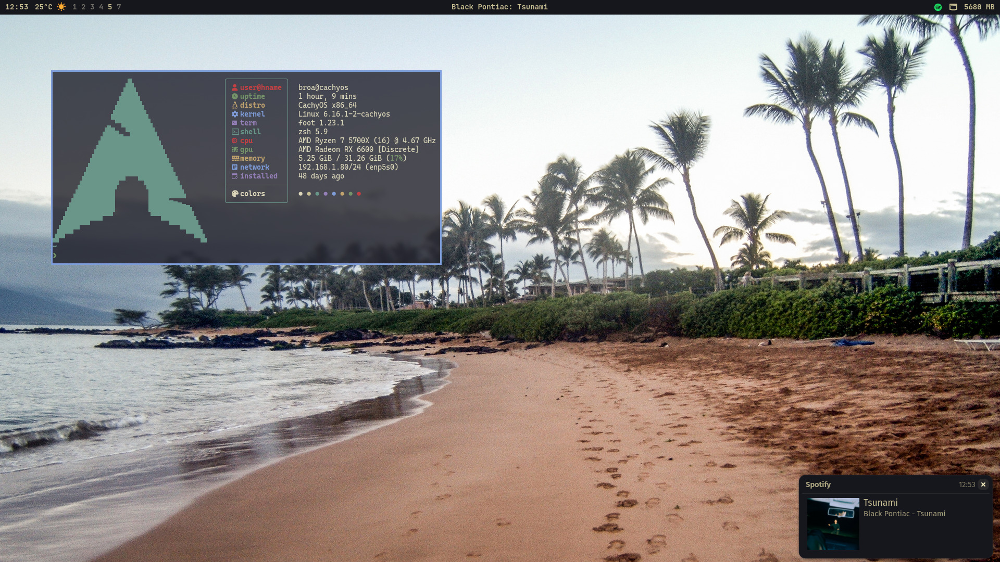
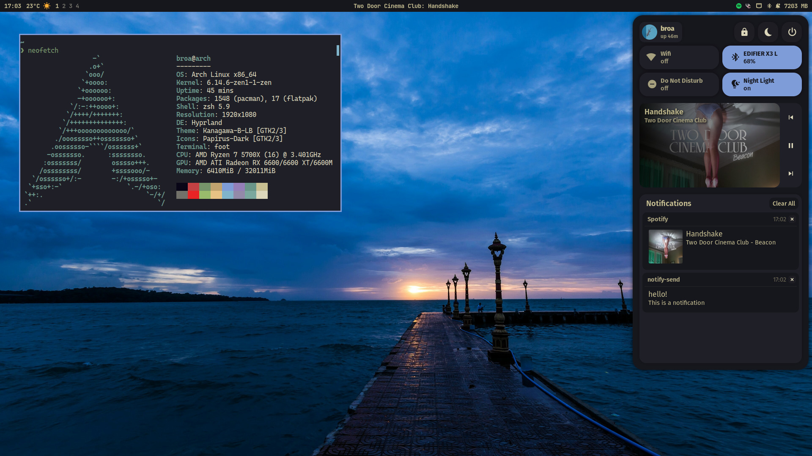

<div align="center">

# dotfiles 🐧
[](https://github.com/mttomaz/dotfiles/stargazers)
[](https://github.com/mttomaz/dotfiles/issues)
[](https://github.com/mttomaz/dotfiles)
[](https://github.com/mttomaz/dotfiles/blob/master/LICENSE)

</div>

<br>




These are my personal configs for Linux, they are designed to be lightweight and easy to manage.

## Features
- **Window Managers**: Configurations for Niri, Hyprland and BSPWM.
- **Development Tools**: Pre-configured for Python, Rust, Flutter, and more).
- **Automation**: Managed with [chezmoi](https://www.chezmoi.io/) for consistent setup across systems.

## Installation
Run the following command to initialize my dotfiles with chezmoi:

> [!Caution]
> This will install and configure most applications that i use daily,
> if you just want the files you might wanna copy them from [here](https://github.com/mttomaz/dotfiles/tree/master/home).

  ```bash
  chezmoi init --apply mttomaz
  ```

## Software used
| Software | Wayland | Xorg **(last resort)** |
| ------------- | -------------- | -------------- |
| Compositor/WM | [Niri](https://github.com/niri-wm/niri) or [Hyprland](https://hyprland.org/) | [BSPWM](https://github.com/baskerville/bspwm) |
| Terminal | [foot](https://codeberg.org/dnkl/foot) | [kitty](https://github.com/kovidgoyal/kitty) |
| AppLauncher | [anyrun](https://github.com/anyrun-org/anyrun) | [rofi](https://github.com/lbonn/rofi) |
| Bar and Widgets | [mttomaz/ags](https://github.com/mttomaz/ags) | [eww](https://github.com/elkowar/eww) |

- Neovim Distro: [LazyVim](https://www.lazyvim.org/)
- GTK Theme: [Kanagawa](https://www.pling.com/p/1810560/)
- Icon Theme: [Papirus](https://github.com/PapirusDevelopmentTeam/papirus-icon-theme/)
- Cursor Theme: [cz-Hickson-Black](https://www.gnome-look.org/p/1503665)
- Fonts: JetBrains Mono, Caskaydia Cove (both [Nerd Fonts](https://www.nerdfonts.com/))
- Wallpapers: [mttomaz/wallpapers](https://github.com/mttomaz/wallpapers)

## Inspirations
- [dharmx/vile](https://github.com/dharmx/vile)
- [Battlesquid/dotfiles](https://github.com/Battlesquid/dotfiles)
- [qxb3/conf](https://github.com/qxb3/conf)
- [koeqaife/hyprland-material-you](https://github.com/koeqaife/hyprland-material-you)
- [retrozinndev/colorshell](https://github.com/retrozinndev/colorshell)

## Contributing
If you have suggestions or improvements, feel free to open an issue or submit a pull request.

## License
These dotfiles are provided as-is and are free to use or modify.
If you share them, a credit would be appreciated.

Enjoy!
