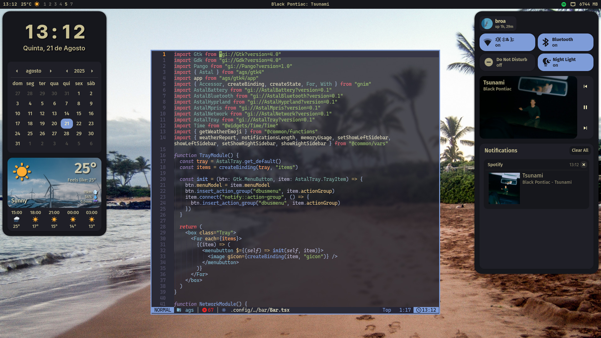

<div align="center">

# dotfiles 🐧
[](https://github.com/mttomaz/dotfiles/stargazers)
[](https://github.com/mttomaz/dotfiles/issues)
[](https://github.com/mttomaz/dotfiles)
[](https://github.com/mttomaz/dotfiles/blob/master/LICENSE)

</div>

<br>




These are my personal configurations for Linux, tailored to enhance productivity and streamline workflows.
They are designed to be lightweight, modular, and easy to manage.

## ⚡ Features
- **Window Managers**: Configurations for Hyprland and BSPWM.
- **Development Tools**: Pre-configured for Python, Rust, Flutter, and more).
- **Automation**: Managed with [chezmoi](https://www.chezmoi.io/) for consistent setup across systems.

## ⚙ Installation
The install script assumes you have a minimal [arch installation](https://wiki.archlinux.org/title/Installation_guide).
Run the following command to initialize my dotfiles with chezmoi:

> [!Caution]
> This will install and configure most applications that i use daily,
> if you just want the files you might wanna copy them from [here](https://github.com/mttomaz/dotfiles/tree/master/home).

  ```bash
  curl -fsSl https://raw.githubusercontent.com/mttomaz/dotfiles/master/install.sh | sh
  ```

## 🛠 Programs used
- Wayland
  - Compositor: [Hyprland](https://hyprland.org/)
  - Terminal: [foot](https://codeberg.org/dnkl/foot)
  - AppLauncher: [wofi](https://hg.sr.ht/~scoopta/wofi)
  - Bar and Widgets: [ags](https://aylur.github.io/ags/)
- Xorg **(deprecated)**
  - Window Manager: [BSPWM](https://github.com/baskerville/bspwm)
  - Terminal: [kitty](https://github.com/kovidgoyal/kitty)
  - AppLauncher: [rofi](https://github.com/lbonn/rofi)
  - Bar and Widgets: [eww](https://github.com/elkowar/eww)
- Neovim Distro: [LazyVim](https://www.lazyvim.org/)
- GTK Theme: [Kanagawa](https://www.pling.com/p/1810560/)
- Icon Theme: [Papirus](https://github.com/PapirusDevelopmentTeam/papirus-icon-theme/)
- Cursor Theme: [cz-Hickson-Black](https://www.gnome-look.org/p/1503665)
- Fonts: JetBrains Mono, Caskaydia Cove (both [Nerd Fonts](https://www.nerdfonts.com/))

## 🏗 Structure
- `.config/`: Contains configurations for window managers, terminal, and other applications.
- `.local/share/themes/` && `.local/share/icons/`: Houses theme and cursor files.
- `.local/bin/`: Simple scripts used across the entire system.
- `scripts/`: Custom scripts for automation and other tasks.

## 🌟 Inspirations
- [dharmx/vile](https://github.com/dharmx/vile)
- [Battlesquid/dotfiles](https://github.com/Battlesquid/dotfiles)
- [qxb3/conf](https://github.com/qxb3/conf)
- [koeqaife/hyprland-material-you](https://github.com/koeqaife/hyprland-material-you)

## 🤝 Contributing
If you have suggestions or improvements, feel free to open an issue or submit a pull request.

## 📜 License
These dotfiles are provided as-is and are free to use or modify.
If you share them, a credit would be appreciated.

Enjoy!
